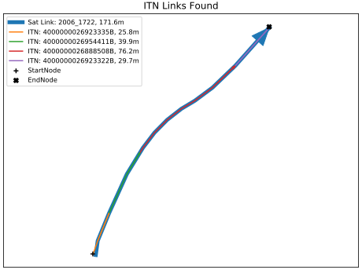

# Lookup Outputs

## Outputs

The lookup produces a number of outputs, the main one is the lookup CSV, however another CSV
and a number of graphs are produced to aid with checking the process. The CSVs and graphs
produced are described below, in addition to the interactive checks that can be performed.

### CSVs

There are 2 CSVs outputs produced by the lookup, the first is a CSV containing the following
columns:

- **SATURN_Link_ID**: The link ID of the SATURN link, this column will continue duplicates if
  the link is made up of more than one lookup link.
- **ITN_Link_ID**: The link ID of the corresponding link in the other shapefile, this column
  may contain duplicates if the link is split between two SATURN links.
- **SATURN_Length(m)**: The length of the SATURN link in metres.
- **ITN_Overlap_Length(m)**: The length of the lookup link which overlaps with the SATURN
  link, using a buffer around the SATURN link to check overlap with.
- **ITN_SAT_Angle**: The (smallest) angle between the SATURN and lookup link.
- **Method**: The algorithm which was used to find the corresponding link, should be either
  Within or ShortestPath.
- **StartNode**: The coordinates of the starting position in the lookup network for finding
  the shortest path, not applicable if method is Within.
- **EndNode**: Same as above but for the ending position.
- **StartLink**: The link in the lookup network which was nearest to the start of the model
  link, the start position of this link is used for the StartNode not used if the start of
  the model link is close (parameter to set how close) to a node in the lookup network.
- **EndLink**: Same as above but for the ending link.
- **Comment**: A comment describing any errors/warnings that occurred when finding the lookup
  links for this model link.

The second CSV aggregates all the lookup links together to compare the total length of the
links found with the length of the model links and has the following columns:

- **SATURN_Link_ID**: The link ID of the SATURN link.
- **SATURN_Length(m)**: The length of the SATURN link in metres.
- **ITN_Overlap_Length(m)**: The total overlap length of all the lookup links which overlap
  with the SATURN link, in metres, using a buffer around the SATURN link to check overlap with.
- **Length_Diff(m)**: The difference between the SATURN_Length ($l_M$) and the ITN_Overlap_Length
  ($l_O$), using the formula $l_O-l_M$.
- **Length_%Diff**: The percentage difference between the two lengths, as above, using the formula
  $\frac{l_0}{l_M}-1$.

### Graphs
TODO
#### Interactive Graphs
TODO

## Checks
The majority of the outputs produced are designed to help the user check that the process has
worked as expected and indicate areas where there may be issues. The lookup is heavily dependant
on the input shapefiles being similar for producing a good output and requires a thorough checking
process in order to determine whether the outputs are good enough for the required use case. The
[Checklist](#checklist) section discusses what checks could be undertaken but is not an exhaustive
list, [manual checks](#manual-checking-mode) discusses what methods could be used for checking 
individual links.

### Checklist
The checklist below gives suggestion of checks that should be undertaken in order to understand
the likely accuracies of the links across the network, the links are grouped into different bands
that can be assigned an accuracy based on whether they're likely to be fit for the required purpose.
The below checks are designed to find the groups of links which are most likely to be not fit for
purpose so that they can be improved in [post processing](#post-processing), although due to the nature
of how the correctness of a link is determined the accuracies produced will only ever be estimates
and as such should be used to give evidence as

1. Firstly some high level checks should be undertaken by using the graphs produced to see the spread
   of the output data, specifically looking at percentage length difference. The length difference
   gives an indication of links which are likely to be correct or incorrect, however a link with a
   difference of $\approx0\%$ is not necessarily correct, similarly a link with a difference of
   $>50\%$ isn't necessarily incorrect.
2. In addition to checking the graphs, a check of the high level statistics should be done, looking
   at the number of links which have an error and possibly creating new distributions of the length
   difference, angles or errors to see how the network looks as a whole.
3. In order to gain a greater understanding of whether a link with $X\%$ length difference is likely
   to be correct or not a sample of links for different bands should be checked manually
   ([see below](#manual-checking-mode)) in order to get an estimate of the accuracy for each band, e.g.
   check a sample of links for 0-5%, 5-10%, 10-20%... and see what proportion of each group are
   correct. Performing these sample checks should give an indication of which bands can be deemed
   acceptable and which need further checks.
4. As well as performing manual checks for the difference length difference bands, the same checks
   can be performed for bands split by error type to see what may be causing these errors.
5. Once the checks above have been performed this information should be collated together to produce
   a summary of the accuracy of the various groupings above and whether each group can be considered
   fit for purpose. The network can then be plotted in GIS using the bands from above to see which parts
   of the network fit into each band, which gives an indication of the links which are more, or less,
   likely to be fit for purpose.

### Manual Checking Mode
An additional mode has been added to the tool to allow each link to be viewed with the corresponding
links that have been found, this can be accessed by rerunning the tool with the same inputs and an
output file that exists without the `--findlinks` parameter. This will load up the input shapefiles
and the output and allow a link ID to be entered to produce a graph showing the model link and all
the corresponding links in the lookup.

The mode described above shows you what links have been found and this can be compared to the
shapefiles when they're opened in GIS to determine whether the links found are correct (or good
enough to be fit for purpose). 

## Post Processing
TODO
