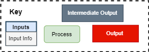
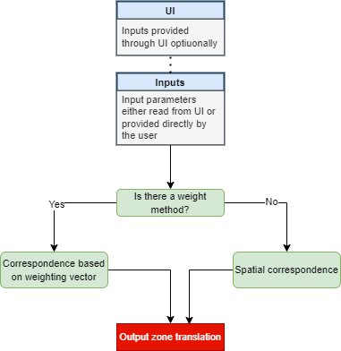
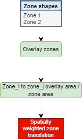
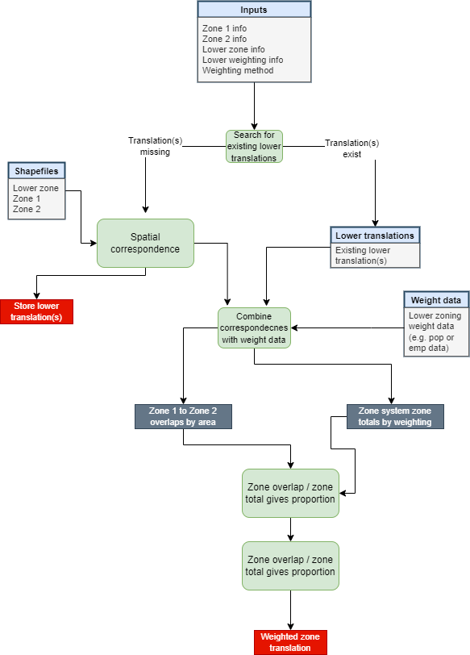

OP Model
========

This section contains the op models for the caf.space tool

Key
---

   *figure 1* - Key for op models
   
High Level Run
--------------

   *figure 2* - A high level view of how the tool runs
   
Spatial Translation
-------------------

   *figure 3* - How the spatial translation runs
   
Weighted Translation
--------------------

   *figure 4* - How the weighted translation runs. Refer to :doc:`weighted_trans` for a more detailed explanation of this process