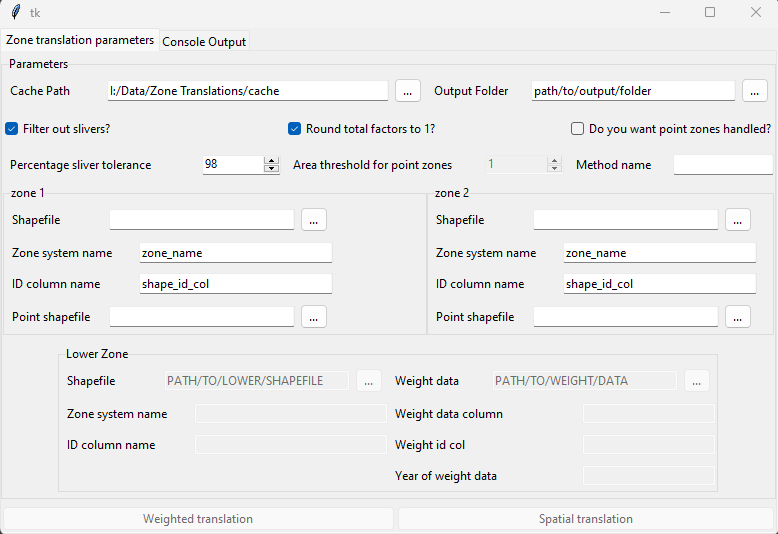

Graphical User Interface
========================

When launched, the gui will display a window as shown below:

    *figure 1* - GUI main window

Within this window the fields must be filled out in order to run the tool, with descriptions below for how to fill them in.
There is also a 'Console Output' window, which will display messaged raised by the tool. This can be useful to check if a translation
fails for some reason, as it will give information on which setting caused the issue, such as a path provided which does not exist.

Parameters
----------

The parameters in the gui are the same as running the tool in other ways:

 - Cache Path - This is where the generated translation will be saved automatically
 - Output Folder - This is where the translation will be saved for the user to pick up
 - Filter our slivers?: This decides whether any filtering will be done for very small overlaps
 - Round total factors to 1: This decides whether final factors will be normalised. It is recommended to keep this ticked
 - Do you want point zones handles?: This determines whether any zones will be handled as points. This will usually not be selected
 - Percentage sliver tolerance: The threshold for sliver filtering. As it is, any factors of 0.02 or less will be removed, and the remaining factors normalised to sum to 1
 - Area Threshold for point zones: If point handling is selected, this determines the area below which a polygon zone will be considered a point zone. This defaults to 1, which is very small and unlikely to pick up any polygons as points.
 - Method name: The name of the weighting method if using running a weighted rather than spatial translation. This must be provided to run a weighted translation.
 - Zone 1/2: The two zones a translation is being produced between:
    - Shapefile: Path to file containing respective zone.
    - Zone system name: The name of the respective zone system. This will determine column names and file name in output.
    - ID column name: The column containing ID in the input shapefile.
    - Point shapefile: Optional, a second shapefile containing point data as true points.
 - Lower zone: The zone system used for a weighted translation, see description of weighted translation for more info.
    - Weight data: A path to a csv containing weighting data, e.g. pop
    - Weight data column: The  column in the weight data csv containing the weight data
    - Weight id col: The column in the weight data csv containing the id.
    - Year of weight data: The year the weight data is from, e.g. population data from the 2021 census.
 - Weighted translation: The button to run a weighted translation. All parameters must be provided for this.
 - Spatial translation: The button to run a spatial translation.
