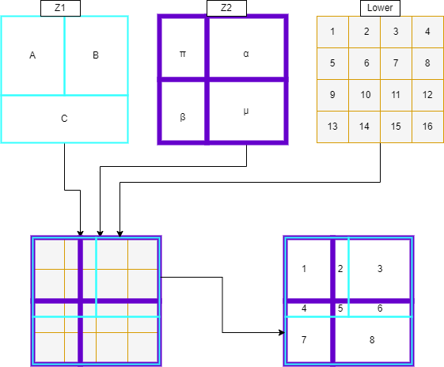

Explanation of Weighted Translation
===================================

Intro
-----

This gives an example of how to generate a lower-zone-weighted translation between two zoning systems
(Z1 and Z2). A spatial translation between Z1 and Z2 is much simpler and simply accounts for area overlap.
Weighted translation considers where the weighted value is in each zone. 

For example, if a larger zone was split exactly in half spatially by a smaller zone, but one half contained
a block of flats and the other a park, different translations would be given depending on the method.
Spatially, the larger zone is simply split in 2 exactly. If the translation was generated via a population 
weight, then the entire population weight of the larger zone would be placed into the smaller zone containing
the flats, with none going to the park side of the larger zone.  To give an example from figure 1, the left
zone from Z1 is split into the left two zones from Z2, if done spatially, will give a 50/50 split. If,
however, lower zones 1 and 2 contain a town, and the rest of the lower zones contain mainly rural land, then
using a population or employment weighted translation would give a larger proportion to the top zone –
containing the town – and a smaller proportion to the bottom, mainly rural, zone. In most cases this would be
a more accurate representation of reality. 

.. figure:: images/simple_weighted.png
   
   *Figure 1* - Simple weighted translation example
   
Example
-------

In the above example, the lower zoning system nest within the larger zone systems, which nest within each
other, giving a relatively simple translation. A more complicated example is described below. The description
corresponds to figures 2 and 3 at the end of the document. 

Generating “Tiles”
------------------

First, the three zoning systems are overlayed on top of one another, this can be seen in Figure 2 below,
creating the image in the bottom left corner. The lower zoning system is then split into “tiles” based on the
following conditions: 

	1. **Where a whole lower zone fits into both higher zones.** A “tile” is formed as the whole lower zone, as for lower zone 1 in Figure 2. 

	2. **Where a lower zone crosses zone boundaries for either or both higher zones.** Its weighting is split by area and a new “tile” generated for each split. This is true for lower zone 10 which is evenly divided into 4 spatially, and therefore its weighting value is too. 

The result of this step can be seen in Figure 3, in the bottom left, longest table. This table shows how the
weights in the lower zoning system have been distributed across the new “tiles” that have been generated.  

Simplify to “Overlap Zones”
---------------------------

Next, the “tiles” are simplified into “overlap zones”. In this case, 8 overlap zones are generated and can be
spatially seen in the bottom right of Figure 2. Mathematically the large table is taken and simplified into 3
new, smaller tables, shown in Figure 3. 

	1. **Overlap Table.** Generated by summing the unique combinations of Z1 and Z2 zone names. This table also represents the values assigned to the spatial overlap shown in Figure 2. 

	2. **Z1 Table.** Generated by summing the unique values of Z1 zone names. This table gives the total weighted value assigned to each Z1 zone. 

	3. **Z2 Table.** Generated by summing the unique values of Z2 zone names. This table gives the total weighted value assigned to each Z2 zone. 

These tables are represented in Figure 3 with some example numbers.

Translation Factors
-------------------

Finally, to convert these table into actual translation values between Z1 and Z2 the overlap values are
divided by the total values for each zone. This generated translations values in both directions (Z1 -> Z2
and Z2 -> Z1). Where a zone from one zone system fits entirely within a zone from the other zone system, the
weighting given is 1. This is true for zone π in Z2, which fits entirely within zone A in Z1. Otherwise, the
factors sum to one over each zone. 

It should be noted that the example translation given here is deliberately complicated (not many zones nest
perfectly within each other). In many cases zones will nest better, and especially the lower zones should
cross higher zone boundaries as rarely as possible for best results.

   *figure 2* - Example diagrams of a zone translation schematically. Here the translation is between Z1 and Z2
   with weighting from the 'lower' zone.
   
.. figure:: images/table_ex.png

   *figure 3* - Example tables to go with the schematic example above. The rightmost two columns in the final
   table are the actual zone translation outputs.

The inputs used in this example are included in the examples folder in the repo.